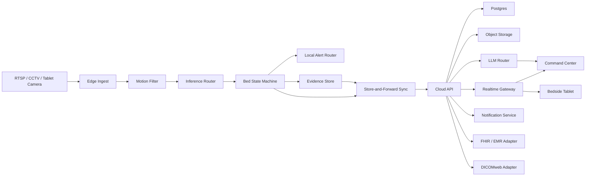

# Architecture

## Architecture Summary

AINA Healther Vision uses a hybrid edge-cloud architecture.

Edge handles video proximity: camera ingest, local motion filtering, low-latency event detection, temporary clips, privacy masking, and store-and-forward sync.

Cloud handles coordination: authenticated APIs, command center, event persistence, assistant orchestration, integrations, notifications, audit, and deployment management.

## System Diagram



## Services

### apps/edge

Runs inside the hospital network.

Responsibilities:

- Camera connection and health checks.
- Frame sampling.
- Local motion detection.
- Object/pose/OCR inference.
- Bed-zone geometry.
- Event state machines.
- Privacy masks.
- Evidence clip capture.
- Offline queue.
- Sync to cloud.

Suggested stack:

- Python 3.11+.
- FastAPI for local admin API.
- OpenCV for motion and video primitives.
- ONNX Runtime or PyTorch for local models.
- SQLite for local queue and device state.
- Docker Compose for deployment.

### apps/api

Cloud API and orchestration.

Responsibilities:

- Auth and RBAC.
- Hospital, ward, bed, camera, user, and role APIs.
- Event ingestion and validation.
- Alert routing and escalation.
- Patient state aggregation.
- Assistant tool APIs.
- FHIR and DICOMweb adapters.
- Audit logs.

Suggested stack:

- Python 3.11+.
- FastAPI.
- Postgres.
- Redis for queues and event bus.
- Object storage for evidence clips.

### apps/web

Command center.

Responsibilities:

- Multi-bed grid.
- Single-bed view.
- Timeline and event review.
- Ask AINA panel.
- Alert center.
- Admin and calibration surfaces.

Suggested stack:

- Next.js with TypeScript.
- Realtime over WebSocket or Supabase Realtime.
- Component library kept simple and accessible.

### apps/tablet

Bedside tablet app.

Responsibilities:

- Receive alerts and calls.
- Show patient context and task queue.
- Allow staff acknowledgment.
- Optional round camera capture during clinician rounds.

Suggested stack:

- Expo / React Native for later.
- For MVP, a responsive web bedside app is acceptable.

### apps/worker

Background processing.

Responsibilities:

- Morning digest generation.
- Clip lifecycle jobs.
- Retry queues.
- Report exports.
- Model evaluation batches.

## Data Model

Core entities:

- Organization.
- Hospital.
- Ward.
- Bed.
- Camera.
- Patient.
- Encounter.
- User.
- Role.
- Event.
- EventReview.
- EvidenceAsset.
- VitalReading.
- Alert.
- AlertDelivery.
- AssistantMessage.
- AuditLog.
- IntegrationEndpoint.

Event model must include:

- Stable event ID.
- Event type and schema version.
- Hospital, ward, bed, camera, patient, encounter.
- Severity.
- Confidence.
- Timestamps: captured, detected, ingested, acknowledged, resolved.
- Rule trace.
- Evidence references.
- Review status.
- Source service and model version.
- Payload JSON with strict validation.

## Event Contract

All events should follow this shape:

```json
{
  "event_id": "evt_...",
  "event_type": "PATIENT_ON_FLOOR_OR_FALL",
  "schema_version": "2026-05-18",
  "severity": "critical",
  "hospital_id": "hosp_...",
  "ward_id": "ward_...",
  "bed_id": "bed_...",
  "patient_id": "pat_...",
  "camera_id": "cam_...",
  "captured_at": "2026-05-18T10:00:00Z",
  "detected_at": "2026-05-18T10:00:05Z",
  "confidence": 0.91,
  "rule_trace": "person centroid below bed floor line for 5.2s",
  "evidence": ["asset_..."],
  "review_required": true,
  "payload": {}
}
```

## Inference Design

V1 should use layered inference instead of a single expensive VLM call.

1. Motion filter: cheap, local, continuous.
2. Detection/pose/OCR: local or hosted, event-triggered or scheduled.
3. State machine: deterministic and auditable.
4. VLM gate: only for ambiguous or high-impact events.
5. Human review: required for critical events before clinical chart write.

## Model Choices

Start provider-flexible. Do not hardwire application code to any single AI provider.

Recommended defaults:

- Person/object detection: YOLO-family or RF-DETR through an inference adapter.
- Pose: RTMPose or MediaPipe for prototype, replace after evaluation.
- Tracking: Norfair for license cleanliness.
- OCR: Gemini/VLM in v0, PaddleOCR or tuned OCR in production where reliable.
- Assistant: model router with source-grounded tool calls.

## Privacy Architecture

Default stance:

- Continuous raw video stays on the edge device.
- Upload event clips only when necessary and allowed by hospital policy.
- Apply privacy masks where possible.
- Encrypt local disk and cloud storage.
- Use short retention for non-event video.
- Long retention requires explicit policy.

## Connectivity Behavior

The edge device must run even when cloud connectivity is down.

When offline:

- Continue local event detection.
- Keep local alerts working.
- Queue events and evidence metadata.
- Defer cloud sync.
- Show degraded status in command center when connection returns.

## Deployment Topology

Pilot topology:

- 1 edge box per ward or ICU bay.
- 4 to 8 camera feeds per edge box for MVP.
- Cloud API and web app in nearest region.
- Postgres managed service.
- Object storage with lifecycle rules.
- Optional VPN or secure tunnel to hospital network.

## Observability

Track:

- Camera uptime.
- Frame ingest FPS.
- Detection latency.
- Event count by type and severity.
- False positive and false negative review counts.
- Alert acknowledgment latency.
- Sync backlog.
- Storage growth.
- Model version performance.
- Assistant refusal and unsupported-answer rates.

## Security Requirements

- Role-based access control.
- Audit log for every PHI access and every event action.
- Secrets stored in a secret manager.
- No PHI in normal app logs.
- Signed evidence URLs with expiry.
- Per-hospital data partitioning.
- Backups and restore drills.
- Security headers and standard web hardening.

## Integration Strategy

V1:

- Native event and patient timeline.
- FHIR-compatible data model.
- Export to CSV/JSON/PDF for pilot reporting.
- Basic FHIR Observation write after review.

V1.5:

- DICOMweb image metadata and thumbnails.
- Hospital-specific EMR adapters.
- WhatsApp/SMS/push notification adapters.

V2:

- More formal FHIR server or managed FHIR bridge.
- PACS integration at production depth.
- Full hospital SSO.
